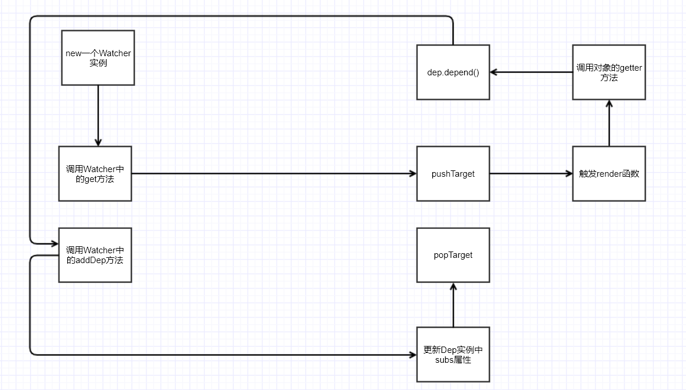
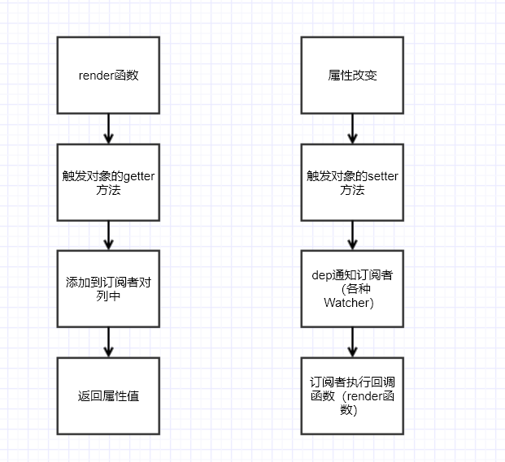

# VUE源码解析--Watcher类

  Watcher类的作用：在特定的时机去执行回调函数（渲染函数等）

  

  Watcher分为了几类：

  一种就是render-watcher 这种对应的就是我们使用的 
  ``` javascript
    new Vue({
      template:'<div>{{name}}</div>',
      data(){
        return {
          name:'123'
        }
      }
    })
  ```
  一种就是计算属性：也会生成一个computed-watcher  可以等依赖的变量改变的时候才会重新计算

  还有一种就是我们自定义的watch    handler函数  


  这里我们拿render-watcher来画了一个流程图
  
  

  ``` javascript
    // src/instance/lifecycle.js

    // Watcher 的 getter 方法

    updateComponent = () => {
      // _render函数 返回一个 vnode
      // _update 去执行 patch 的过程
      vm._update(vm._render(), hydrating)
    }

    //组件挂载的时候  
    new Watcher(vm, updateComponent, noop, {
      before () {
        if (vm._isMounted && !vm._isDestroyed) {
          callHook(vm, 'beforeUpdate')
        }
      }
    }, true /* isRenderWatcher */)

  ```


  下面来整体看一下vue中实现响应式的原理

  可以思考一下下面的问题：

  1. vue如何知道数据改变了？   数据改变会触发set方法 

  2. 数据改变了如何知道应该渲染那些视图？  数据get方法中会收集依赖

  3. 数据改变后如何通知视图更新？   set中 执行 dep.notify()


  