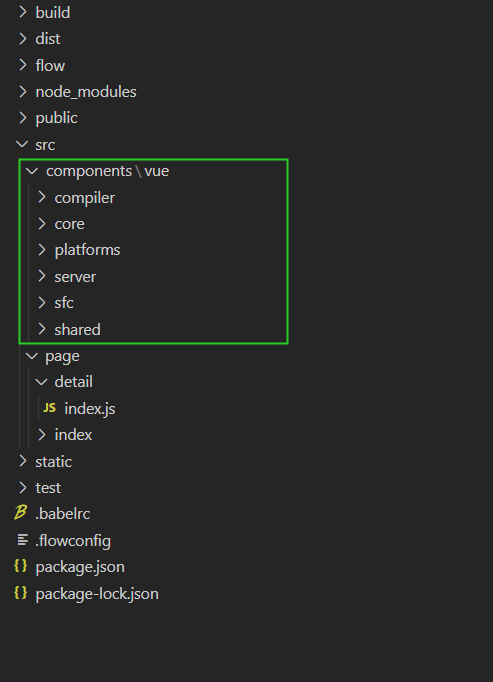
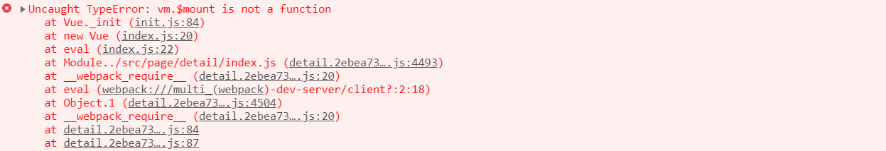
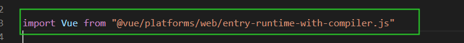
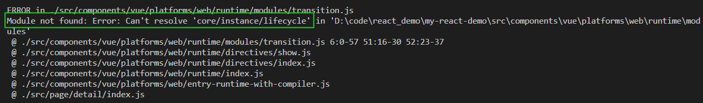
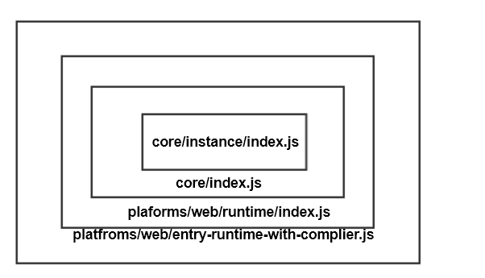
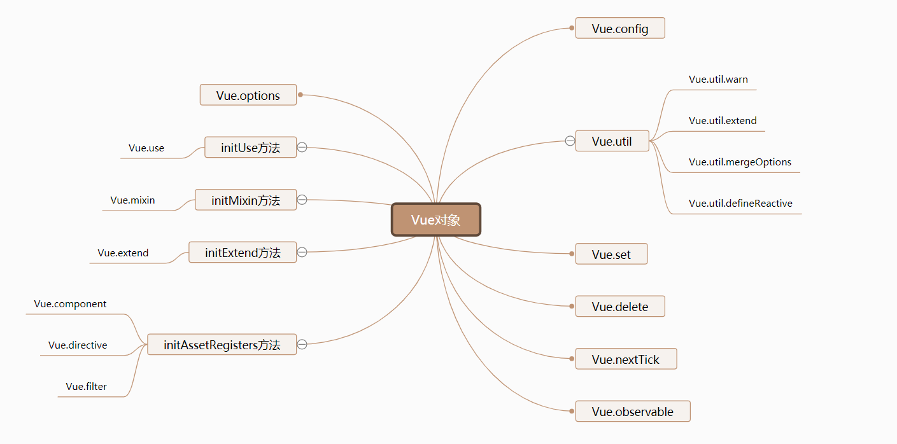
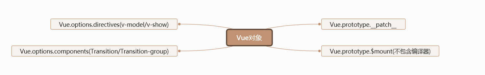
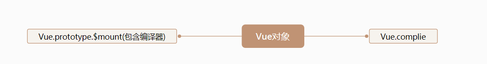
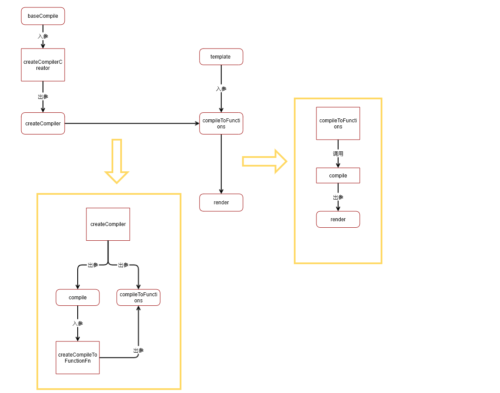
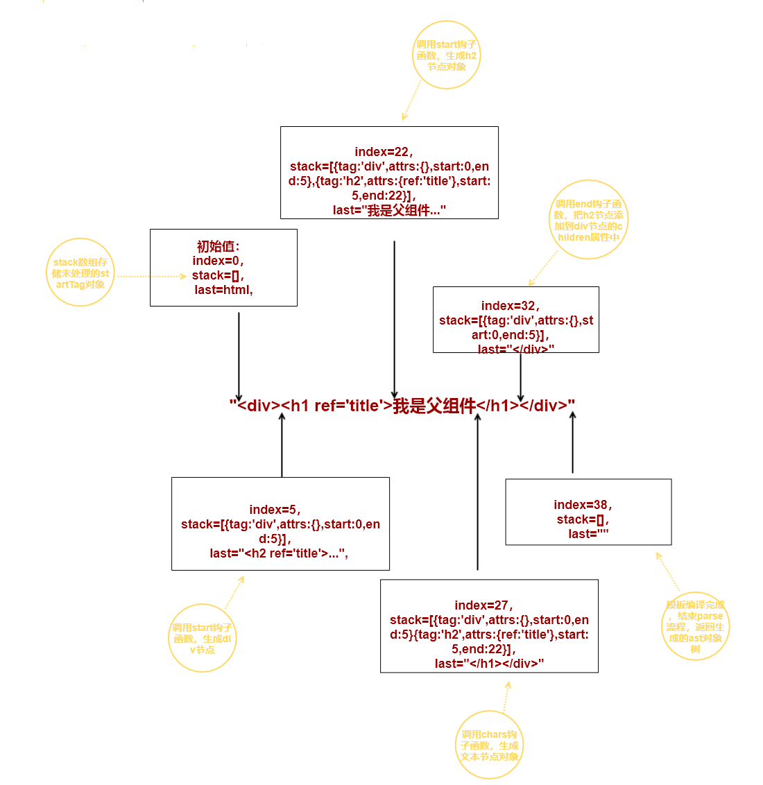

# VUE源码解析 -- 准备工作
  前段时间看了Vue的源码，但是总感觉晕晕乎乎的，整体流程总是串不起来，于是想到了从new Vue()开始一步步的看看到底都发生了什么事情，废话不多说，下面一起来探索一下

 ## 准备工作
 1. 下载[Vue源码](https://github.com/vuejs/vue)
 2. 准备一个支持Vue的前端工程脚手架，可以使用上篇文章中[webpack搭建项目](https://juejin.im/post/6870312297055649800)的工程（如果不想自己搭建的话，可以直接私信我，就不放GitHub上地址了）
 3. 把Vue源码中的src目录拷贝到自己的脚手架，目的是可以直接引用Vue对象
 4. 运行项目，new Vue()可以正常运行

 上面所说的其实就是把vue源码当做一个插件，添加到我们的项目中来，这样的话我们就可以随意调试，来查看整体的流程
 工程目录如下：
 


  按照上面做完之后，运行项目应该会出现以下报错，但是不要慌，我们一个一个来解决

  1. vm.$mount is not a function 
  
  这个报错是因为我引用Vue对象的时候引用的是core/index.js中的Vue，此时的Vue不包含$mount方法  
  解决思路：  
  我们知道Vue构建版本包括：完整版（编译器+运行时）和运行时  
  我们使用Vue对象的时候需要包括编译器的，因为我们要查看代码中编译模板的过程，因此我们可以查看一下Vue源码中构建的入口，这样我们就知道我们应该引用哪个文件才包含Vue完整的功能，Vue构建是在源码中的script/config.js中定义了各种版本的构建开始入口：
  ``` javascript
  // script/config.js 部分代码 
  const builds = {
    // Runtime only (CommonJS). Used by bundlers e.g. Webpack & Browserify
    'web-runtime-cjs-dev': {
      entry: resolve('web/entry-runtime.js'),
      dest: resolve('dist/vue.runtime.common.dev.js'),
      format: 'cjs',
      env: 'development',
      banner
    },
    'web-runtime-cjs-prod': {
      entry: resolve('web/entry-runtime.js'),
      dest: resolve('dist/vue.runtime.common.prod.js'),
      format: 'cjs',
      env: 'production',
      banner
    },
    // Runtime+compiler CommonJS build (CommonJS)
    'web-full-cjs-dev': {
      entry: resolve('web/entry-runtime-with-compiler.js'),
      dest: resolve('dist/vue.common.dev.js'),
      format: 'cjs',
      env: 'development',
      alias: { he: './entity-decoder' },
      banner
    },
    'web-full-cjs-prod': {
      entry: resolve('web/entry-runtime-with-compiler.js'),
      dest: resolve('dist/vue.common.prod.js'),
      format: 'cjs',
      env: 'production',
      alias: { he: './entity-decoder' },
      banner
    },
    ...
  }


  ```
  通过上面的entry选项我们可以看到不同版本的入口文件是什么，然后我们找到对应的文件，然后引用对应的文件就可以得到不同的Vue，我们完整版的Vue应该是在web/entry-runtime-with-compiler.js，因此我们使用Vue对象的时候直接引用这个文件中的Vue对象就好了
  

  2. Vue源码中引用文件路径不正确  
    
  这个是因为我们直接把源码拷过来了，对应的路径不正确，只需要我们做个映射就好了（可以看到Vue源码里面也做了映射）
  
  ``` javascript
  // Vue源码中 script/alias.js 
  const path = require('path')

  const resolve = p => path.resolve(__dirname, '../', p)

  module.exports = {
    vue: resolve('src/platforms/web/entry-runtime-with-compiler'),
    compiler: resolve('src/compiler'),
    core: resolve('src/core'),
    shared: resolve('src/shared'),
    web: resolve('src/platforms/web'),
    weex: resolve('src/platforms/weex'),
    server: resolve('src/server'),
    sfc: resolve('src/sfc')
  }
  

  // 在我们自己的工程里面同样做个映射
  // 也就是设置别名： resolve的alias选项
  resolve:{
        alias:{
            "@vue": path.resolve(__dirname,"../src/components/vue"),
            vue: path.resolve(__dirname,'../src/components/vue/platforms/web/entry-runtime-with-compiler'),
            compiler: path.resolve(__dirname,'../src/components/vue/compiler'),
            core: path.resolve(__dirname,'../src/components/vue/core'),
            shared: path.resolve(__dirname,'../src/components/vue/shared'),
            web: path.resolve(__dirname,'../src/components/vue/platforms/web'),
            weex: path.resolve(__dirname,'../src/components/vue/platforms/weex'),
            server: path.resolve(__dirname,'../src/components/vue/server'),
            sfc: path.resolve(__dirname,'../src/components/vue/sfc')
        }
    },
  ```

  这样我们就不需要修改我们的结构和源码就可以正常运行起来了    

  OK, 这是我遇到的两个问题，解决之后工程就可以正常的使用了  
  
  下面我们就可以发挥程序员调试的本领来尽情的发挥了

  ## 下期预告： new Vue() 都干了啥
  

  # VUE源码解析 -- Vue初始化流程解析
  
  在讲new Vue()干了啥之前，我们先看一下在引入Vue对象的时候发生了什么。

  我们知道import执行的时候 对应的文件代码会执行，在这个过程中给Vue绑定了很多我们后面会用到的方法和属性，所有在这里有必要说明一下：  
  我们先看一下引用关系：  
    
  通过这个关系我们能够看到我们实际使用的Vue对象是经过了层层包装导出的，下面我们在分别看一下每个文件中都对Vue对象做了什么封装  
  1. **core/instace/index.js**  
  定义了Vue的构造函数以及给Vue.prototype对象添加了一些方法：  
  
  2. **core/index.js**  
  给Vue对象增加多个属性和方法，对应官方文档中的全局配置和全局API：  
    
  3. **plaforms/web/runtime/index.js**  
  增加全局指令和内置全局组件,定义$mount（不包含编译器）和__patch__（diff算法函数）:  
    
  4. **platfroms/web/entry-runtime-with-complier.js**  
  重新定义$mount(包含编译器)和Vue.compile（将一个模板字符串编译成 render 函数）  
    
  
  上面我们主要说了在我们平时项目中import Vue对象的时候会发生的东西，下面我们来进入正文，看一下new Vue会执行什么操作： 

  new操作符相信大家经常使用，new操作符实际执行的是 创建一个对象，然后设置该对象的__proto__指向后面的Vue.prototype  
  **new Vue()实际执行的顺序是：**
  1. **创建一个新对象**
  2. **设置该对象的__proto__指向Vue.prototype**
  3. **执行Vue构造函数，并把设置构造函数中的this为该对象**
  4. **返回该对象**  
  其实主要的逻辑就是第三步，下面我们来看一下执行Vue构造函数的逻辑  
  **主要就是执行_init方法：**  
  ``` javascript
  // instance/index.js
  function Vue (options) {
    // 直接调用Vue构造函数 给出warning提示
    if (process.env.NODE_ENV !== 'production' &&
      !(this instanceof Vue)
    ) {
      warn('Vue is a constructor and should be called with the `new` keyword')
    }
    // 执行_init方法
    this._init(options)
  }
  // instance/init.js
  export function initMixin (Vue: Class<Component>) {
    Vue.prototype._init = function (options?: Object) {
      const vm: Component = this
      // a uid
      vm._uid = uid++

      let startTag, endTag
      /* istanbul ignore if */
      /*
        性能监控
      */
      if (process.env.NODE_ENV !== 'production' && config.performance && mark) {
        startTag = `vue-perf-start:${vm._uid}`
        endTag = `vue-perf-end:${vm._uid}`
        mark(startTag)
      }
      // a flag to avoid this being observed
      vm._isVue = true
      // merge options 合并参数（options）
      if (options && options._isComponent) {
        // optimize internal component instantiation
        // since dynamic options merging is pretty slow, and none of the
        // internal component options needs special treatment.
        initInternalComponent(vm, options)
      } else {
        // 根据不同的策略合并不同的属性 props data ... 
        vm.$options = mergeOptions(
          resolveConstructorOptions(vm.constructor),// vm.constructor 返回的是构造函数的引用 Vue对象
          options || {},
          vm
        )
      }
      /*
        设置render函数执行作用域
      */
      if (process.env.NODE_ENV !== 'production') {
        initProxy(vm)
      } else {
        vm._renderProxy = vm
      }
      vm._self = vm
      initLifecycle(vm)
      initEvents(vm)
      initRender(vm)
      callHook(vm, 'beforeCreate')
      initInjections(vm)
      initState(vm)
      initProvide(vm) 
      callHook(vm, 'created')

      if (process.env.NODE_ENV !== 'production' && config.performance && mark) {
        vm._name = formatComponentName(vm, false)
        mark(endTag)
        measure(`vue ${vm._name} init`, startTag, endTag)
      }
      if (vm.$options.el) {
        vm.$mount(vm.$options.el)
      }
    }
  }

  ```
  从上面的代码我们可以看到 _init方法主要执行的是下面的流程：
  - **性能监控(vue初始化过程)**
  - **合并参数**
  - **初始化生命周期参数**
  - **初始化事件相关参数**
  - **初始化render相关参数**
  - **触发beforeCreated生命周期**
  - **初始化inject参数**
  - **初始化options中的props、methods、data、computed、watch参数**
  - **初始化provide**
  - **执行$mount方法**  
  下面我们来详细看一下每个函数都具体做了什么：  
  1. **性能监控(vue初始化过程)**  
  对应代码如下：
  ``` javascript
    let startTag, endTag
    // config.performance 对应全局属性 Vue.config.performance的值
    // mark方法：window.performance.mark方法（根据给出 name 值，在浏览器的性能输入缓冲区中创建一个相关的timestamp（是一个double类型，用于存储毫秒级的时间值。））
    if (process.env.NODE_ENV !== 'production' && config.performance && mark) {
      startTag = `vue-perf-start:${vm._uid}`
      endTag = `vue-perf-end:${vm._uid}`
      mark(startTag)
    }

    ... 
    // formatComponentName 得到当前vm的组件名称 
    // measure:window.performance.measure方法（在浏览器的指定 start mark 和 end mark 间的性能输入缓冲区中创建一个指定的 timestamp）就是获取两个mark标记之间的时间值
    if (process.env.NODE_ENV !== 'production' && config.performance && mark) {
      vm._name = formatComponentName(vm, false)
      mark(endTag)
      measure(`vue ${vm._name} init`, startTag, endTag)
    }

  ```
  总结一下上面的代码就是监控 每个组件init所耗费的时间

  2. **合并参数**
  ``` javascript
    // merge options 合并参数（options）
    // options._isComponent: 当vm对象当做组件被渲染时
    if (options && options._isComponent) {
      // 优化内部组件实例化，因为动态选项合并非常慢，并且没有任何内部组件选项需要特殊处理。
      initInternalComponent(vm, options)
    } else {
      // 根据不同的策略合并不同的属性 props data ... 
      vm.$options = mergeOptions(
        resolveConstructorOptions(vm.constructor),// vm.constructor 返回的是构造函数，也就是Vue对象
        options || {},
        vm
      )
    }
  ```
  合并参数的时候分为两个分支：组件、非组件，举个简单例子来看一下： 
  ComponentA就是当做组件，执行上面的分支，newVue为根组件，进入下面的分支    
  ``` javascript
    const ComponentA = {
      template:`<div class="contentA">
        <h2>我是子组件A</h2>
        </div>`,
      data:function () {
          return {
              count:0,
          }
      },
  }

  var newVue  = new Vue({
      el:"#root",
      template:`<div>
          <h1>我是父组件</h1>
          <ComponentA/>
      </div>
      `,
      data:{
          msg:"hello"
      },
      components:{ComponentA},
  })
  ``` 
  然后思考一下：为什么组件(ComponentA)的options不需要合并呢？   
  这是因为在创建组件的时候就已经把他的参数处理过了，这个地方就不需要再继续处理了。 这个过程后面的文章中会详细讲解，这里我们需要知道组件的options已经被处理过了就可以了

  下面是mergeOptions函数，总结一下它的作用是合并options参数  
  先看一下resolveConstructorOptions 这个函数就是返回Vue.options(这个在前面我们可以看到options参数里面存储的就是内置组件、内置指令等)
  mergeOptions具体实现我们来结合代码来看一下：  
  
  ``` javascript
  // util/options.js
  export function mergeOptions (
    parent: Object,
    child: Object,
    vm?: Component
  ): Object {
    // 检查组件名称是否合法（options.components）
    if (process.env.NODE_ENV !== 'production') {
      checkComponents(child)
    }
    
    if (typeof child === 'function') {
      child = child.options
    }
    // 解析格式为对应的格式，对应代码都比较简单 可以自行去查看
    // 解析props属性 props:[name,age] --> {name:{type:null},age:{type:null}} 如果props是对象的话 直接使用该对象
    normalizeProps(child, vm)
    // 和props类似 都转换成对象的格式
    normalizeInject(child, vm)
    // 格式化自定义指令
    normalizeDirectives(child)
    // 合并extends和mixins选项
    if (!child._base) {
      if (child.extends) {
        parent = mergeOptions(parent, child.extends, vm)
      }
      if (child.mixins) {
        for (let i = 0, l = child.mixins.length; i < l; i++) {
          parent = mergeOptions(parent, child.mixins[i], vm)
        }
      }
    }
    // parent 和child 的数据都已经处理完成
    const options = {}
    let key
    for (key in parent) {
      mergeField(key)
    }
    // 处理child中有，但是parent中没有的属性
    for (key in child) {
      if (!hasOwn(parent, key)) {
        mergeField(key)
      }
    }
    // 不同的属性有不同的合并策略 key--> data/methods/props/mounted等等
    // data --> strats.data
    // props --> 
    // methods-->
    // components --> 
    // computed--> 
    function mergeField (key) {
      //根据不同的属性 使用不同的策略来合并选项
      const strat = strats[key] || defaultStrat
      options[key] = strat(parent[key], child[key], vm, key)
    }
    return options
  }
  // vue对象不同的属性有不同的合并策略，这里我们只列举一两个，感兴趣的同学可以自行去查看不同属性的合并策略
  // 这里我们看一下生命周期的合并函数
  // 生命周期 对应的合并函数是mergeHook 
  // 可以看到 生命周期合并的时候是生成一个数组，当需要调用生命周期钩子函数的时候循环执行数组中的函数
  LIFECYCLE_HOOKS.forEach(hook => {
    strats[hook] = mergeHook
  })
  function mergeHook (
    parentVal: ?Array<Function>,
    childVal: ?Function | ?Array<Function>
  ): ?Array<Function> {
    const res = childVal
      ? parentVal
        ? parentVal.concat(childVal)
        : Array.isArray(childVal)
          ? childVal
          : [childVal]
      : parentVal
    return res
      ? dedupeHooks(res)
      : res
  }
  // 去重复
  function dedupeHooks (hooks) {
    const res = []
    for (let i = 0; i < hooks.length; i++) {
      if (res.indexOf(hooks[i]) === -1) {
        res.push(hooks[i])
      }
    }
    return res
  }
  ```
  
  3. **初始化生命周期参数**
  ``` javascript
   // 这个方法比较简单 复杂点的代码已经加上了注释
  export function initLifecycle (vm: Component) {
    const options = vm.$options
    // locate first non-abstract parent
    // 找到第一个非抽象父类
    let parent = options.parent
    if (parent && !options.abstract) {
      // parent.$options.abstract === true 是keep-alive/transtion 等内置组件
      while (parent.$options.abstract && parent.$parent) {
        parent = parent.$parent
      }
      parent.$children.push(vm)
    }
    // 设置父组件
    vm.$parent = parent
    // 设置根组件 为父类根组件 
    vm.$root = parent ? parent.$root : vm

    vm.$children = []
    vm.$refs = {}

    vm._watcher = null
    vm._inactive = null
    vm._directInactive = false
    vm._isMounted = false
    vm._isDestroyed = false
    vm._isBeingDestroyed = false
  }
  ```
  4. **初始化事件相关参数**

  ``` javascript
  export function initEvents (vm: Component) {
    // 存储父组件中绑定的事件
    vm._events = Object.create(null)
    // 
    vm._hasHookEvent = false
    // 初始化父组件中传过来的函数 
    /*
      例如：<ComponentA @changeFoo="changeMsg"/> 
      vm.$options._parentListeners = {
        changeFoo:function(){...}
      }
    */
    const listeners = vm.$options._parentListeners
    if (listeners) {
      updateComponentListeners(vm, listeners)
    }
  }
  export function updateComponentListeners (
    vm: Component,
    listeners: Object,
    oldListeners: ?Object
  ) {
    target = vm
    // 更新组件上面绑定的事件，遍历listeners和oldlisteners对象 如果listeners有old里面没有 就add，如果old有，new里面没有 就remove； 具体实现后面会详细讲
    updateListeners(listeners, oldListeners || {}, add, remove, createOnceHandler, vm)
    target = undefined
  }
  ```
  5. **初始化render相关参数**
  ``` javascript
  export function initRender (vm: Component) {
    // 存储虚拟dom对象
    vm._vnode = null
    vm._staticTrees = null 
    const options = vm.$options
    // options._parentVnode存储的是 在父组件中的虚拟dom树中的自己
    const parentVnode = vm.$vnode = options._parentVnode 
    // context 指的是
    const renderContext = parentVnode && parentVnode.context
    // options._renderChildren 存储的组件插槽对应的vnode对象数组
    vm.$slots = resolveSlots(options._renderChildren, renderContext)
    vm.$scopedSlots = emptyObject
    vm._c = (a, b, c, d) => createElement(vm, a, b, c, d, false)
    // createElement('h1', '标题') 用在render函数中 返回应该渲染一个什么样的节点给render函数使用
    vm.$createElement = (a, b, c, d) => createElement(vm, a, b, c, d, true)

    // Vnode 中的data属性
    const parentData = parentVnode && parentVnode.data
    // 定义this.$attrs（只有在props中没有声明的属性才会出现在parentData.attrs中）和 this.$listeners属性
    defineReactive(vm, '$attrs', parentData && parentData.attrs || emptyObject, null, true)
    defineReactive(vm, '$listeners', options._parentListeners || emptyObject, null, true)
  }
  ```
  6. **触发beforeCreated生命周期**
  ``` javascript
  // callHook(vm, 'beforeCreate')
  export function callHook (vm: Component, hook: string) {
    
    const handlers = vm.$options[hook]
    const info = `${hook} hook`
    if (handlers) {
      // 前面已经说过每个生命周期可以有多个handle函数
      for (let i = 0, j = handlers.length; i < j; i++) {
        // 就是执行vm.handlers[i],但是增加异常场景报错提示
        invokeWithErrorHandling(handlers[i], vm, null, vm, info)
      }
    }
    // 触发类似这种绑定的生命周期函数 this.$on("hook:updated",function(){...}) 
    if (vm._hasHookEvent) {
      vm.$emit('hook:' + hook)
    }
  }

  ```
  7. **初始化inject参数**
  ``` javascript
  export function initInjections (vm: Component) {
    // resolveInject: vm.$parent逐级向上寻找inject的from对应的provide值
    const result = resolveInject(vm.$options.inject, vm)
    if (result) {
      // 不需要响应式
      toggleObserving(false)
      Object.keys(result).forEach(key => {
        // vm[key]设置get/set方法
        defineReactive(vm, key, result[key])
      })
      toggleObserving(true)
    }
  }
  // 下面在来看一下resolveInject的实现

  export function resolveInject (inject: any, vm: Component): ?Object {
    if (inject) {
      const result = Object.create(null)
      // 支持symbol类型的key
      const keys = hasSymbol
        ? Reflect.ownKeys(inject)
        : Object.keys(inject)

      for (let i = 0; i < keys.length; i++) {
        const key = keys[i]
        // 防止重复监听该对象
        if (key === '__ob__') continue
        const provideKey = inject[key].from
        let source = vm
        // 逐级向上查找inject中from对应的值
        while (source) {
          if (source._provided && hasOwn(source._provided, provideKey)) {
            result[key] = source._provided[provideKey]
            break
          }
          source = source.$parent
        }
        // 如果都没有定义，使用default的值，否则warning提示
        if (!source) {

          if ('default' in inject[key]) {
            const provideDefault = inject[key].default
            result[key] = typeof provideDefault === 'function'
              ? provideDefault.call(vm)
              : provideDefault
          } else if (process.env.NODE_ENV !== 'production') {
            warn(`Injection "${key}" not found`, vm)
          }
        }
      }
      return result
    }
  }

  ```
  8. **初始化options中的props、methods、data、computed、watch参数**
  ``` javascript
  /*
    initState 方法结构很简单 就是初始化对应的参数
    但是请注意下 初始化的顺序是有说法的 ，比如 计算属性可能用到data或者props中的值 watch也可能监听到data、props、computed中的值
  */
  export function initState (vm: Component) {
    // 会把这个vm实例上的所有的依赖（watch实例）放到这个对象中
    vm._watchers = []
    const opts = vm.$options
    // 初始化props属性
    if (opts.props) initProps(vm, opts.props)
    // 初始化methods方法
    if (opts.methods) initMethods(vm, opts.methods)
    // 初始化data
    if (opts.data) {
      initData(vm)
    } else {
      observe(vm._data = {}, true /* asRootData */)
    }
    // 初始化 计算属性
    if (opts.computed) initComputed(vm, opts.computed)
    // 初始化 watch 
    // nativeWatch:这个是因为在个别浏览中会给对象增加一个watch属性，这个地方判断是排除这种情况
    if (opts.watch && opts.watch !== nativeWatch) {
      initWatch(vm, opts.watch)
    }
  }
  // 下面我们来依次介绍一下几个初始化的方法：
  // initProps方法
  function initProps (vm: Component, propsOptions: Object) {
    // vm.$options.propsData 存储着 父组件传过来的props对象 
    // 那是在什么时候赋值的呢？  updateChildComponent方法中赋值，这个后面我们会讲到 
    const propsData = vm.$options.propsData || {}
    const props = vm._props = {}
    // vm.$options._propKeys 缓存props的key值，当后面更新的时候可以直接从数组中遍历拿到
    const keys = vm.$options._propKeys = []
    const isRoot = !vm.$parent
    // 如果不是根组件的话 就不需要把数据变成响应式的 ，因为再父组件中已经是响应式的了 不需要重复定义
    if (!isRoot) {
      toggleObserving(false)
    }
    // 遍历props对象，前面已经格式化过了
    for (const key in propsOptions) {
      // push到 $options的_propKeys选项中
      keys.push(key)
      // 拿到props的key对应的value值
      // validateProp 函数下面会讲
      const value = validateProp(key, propsOptions, propsData, vm)
      // 给vm._props赋值
      defineReactive(props, key, value)
      // 判断一下key 是否在vm对象上，如果不在的话 代理 vm的key属性 get/set的时候去修改vm._props上的值
      /*
       可以看一下proxy函数定义：
       const sharedPropertyDefinition = {
          enumerable: true,
          configurable: true,
          get: noop,
          set: noop
        }
       export function proxy (target: Object, sourceKey: string, key: string) {
          sharedPropertyDefinition.get = function proxyGetter () {
            return this[sourceKey][key]
          }
          sharedPropertyDefinition.set = function proxySetter (val) {
            this[sourceKey][key] = val
          }
          Object.defineProperty(target, key, sharedPropertyDefinition)
        }
      */ 
      if (!(key in vm)) {
        // vm.key --> vm._props.key
        proxy(vm, `_props`, key)
      }
    }
    toggleObserving(true)
  }
  // initProps --- validateProp方法
  export function validateProp (
    key: string, // props的key
    propOptions: Object, // props对象vm.$options.props
    propsData: Object, // vm.$options.propsData  -- 父组件中传过来的值
    vm?: Component 
  ): any {
    const prop = propOptions[key]
    const absent = !hasOwn(propsData, key)
    let value = propsData[key]
    // getTypeIndex：判断props.type是否是Boolean类型 是的话返回类型数组中的下标，不是返回-1
    const booleanIndex = getTypeIndex(Boolean, prop.type)
    if (booleanIndex > -1) {
      // 如果父组件没有传该props 并且没有default选项
      if (absent && !hasOwn(prop, 'default')) {
        value = false
        // <Child name></Child> 这种场景的时候的用法 
        // hyphenate: userName --> user-name
      } else if (value === '' || value === hyphenate(key)) {
        // booleanIndex < stringIndex: type:[Boolean, String]  Boolean优先级更高
        const stringIndex = getTypeIndex(String, prop.type)
        if (stringIndex < 0 || booleanIndex < stringIndex) {
          value = true
        }
      }
    }
    // 说明没有传value值，就使用default中的值 
    if (value === undefined) {
      // 获取default属性的值
      value = getPropDefaultValue(vm, prop, key)
      const prevShouldObserve = shouldObserve
      toggleObserving(true)
      // 监听props的value值
      observe(value)
      toggleObserving(prevShouldObserve)
    }
    return value
  }
  // initMethods方法：遍历，查看名称是否重复，然后调用bind修改methods方法的作用域
  function initMethods (vm: Component, methods: Object) {
    const props = vm.$options.props
    for (const key in methods) {
      if (process.env.NODE_ENV !== 'production') {
        if (typeof methods[key] !== 'function') {
          warn(
            `Method "${key}" has type "${typeof methods[key]}" in the component definition. ` +
            `Did you reference the function correctly?`,
            vm
          )
        }
        // 是否名字已经在props中
        if (props && hasOwn(props, key)) {
          warn(
            `Method "${key}" has already been defined as a prop.`,
            vm
          )
        }
        //isReserved函数是用来判断字符串是否以_或$开头。
        if ((key in vm) && isReserved(key)) {
          warn(
            `Method "${key}" conflicts with an existing Vue instance method. ` +
            `Avoid defining component methods that start with _ or $.`
          )
        }
      }
      // 设置methods的作用域为vm，也就是this对象指向当前Vue对象
      vm[key] = typeof methods[key] !== 'function' ? noop : bind(methods[key], vm)
    }
  }
  // initData方法
  function initData (vm: Component) {
    let data = vm.$options.data
    data = vm._data = typeof data === 'function'
      ? getData(data, vm)// 执行data函数
      : data || {}
    // data的构造函数不是Object的话 warning提示
    /*
      export function isPlainObject (obj: any): boolean {
        return _toString.call(obj) === '[object Object]'
      }
    */
    if (!isPlainObject(data)) {
      data = {}
      process.env.NODE_ENV !== 'production' && warn(
        'data functions should return an object:\n' +
        'https://vuejs.org/v2/guide/components.html#data-Must-Be-a-Function',
        vm
      )
    }
    // proxy data on instance
    const keys = Object.keys(data)
    const props = vm.$options.props
    const methods = vm.$options.methods
    let i = keys.length
    // 命名是否重复校验
    while (i--) {
      const key = keys[i]
      if (process.env.NODE_ENV !== 'production') {
        if (methods && hasOwn(methods, key)) {
          warn(
            `Method "${key}" has already been defined as a data property.`,
            vm
          )
        }
      }
      if (props && hasOwn(props, key)) {
        process.env.NODE_ENV !== 'production' && warn(
          `The data property "${key}" is already declared as a prop. ` +
          `Use prop default value instead.`,
          vm
        )
      } else if (!isReserved(key)) {
        // vm.key --> vm._data.key
        proxy(vm, `_data`, key)
      }
    }
    // 观察data对象，实现双向绑定功能
    observe(data, true /* asRootData */)
  }
  // initComputed方法
  function initComputed (vm: Component, computed: Object) {
    // $flow-disable-line
    // vm._computedWatchers 存储计算属性的Watcher对象，当计算属性中的数据发生改变是调用该watcher来重新计算值
    const watchers = vm._computedWatchers = Object.create(null)
    // computed properties are just getters during SSR
    // 是否服务端渲染
    const isSSR = isServerRendering()

    for (const key in computed) {
      const userDef = computed[key]
      // 计算属性的值可以是对象也可以是函数，函数的话直接当做该属性的getter方法，对象的话是获取该对象的getter属性
      const getter = typeof userDef === 'function' ? userDef : userDef.get
      // 没有get方法，warning提示
      if (process.env.NODE_ENV !== 'production' && getter == null) {
        warn(
          `Getter is missing for computed property "${key}".`,
          vm
        )
      }
      // 添加Watcher依赖，当计算属性中用到的值改变的时候会调用执行该对象的update方法，然后在执行getter函数，从而实现只有计算属性依赖的值发生改变时才会重新求值
      if (!isSSR) {
        // create internal watcher for the computed property.
        watchers[key] = new Watcher(
          vm,
          getter || noop,
          noop,
          computedWatcherOptions
        )
      }

      // component-defined computed properties are already defined on the
      // component prototype. We only need to define computed properties defined
      // at instantiation here.
      if (!(key in vm)) {
        // 把计算属性绑定到vm上面
        defineComputed(vm, key, userDef)
      } else if (process.env.NODE_ENV !== 'production') {
        if (key in vm.$data) {
          // 重复命名warning
          warn(`The computed property "${key}" is already defined in data.`, vm)
        } else if (vm.$options.props && key in vm.$options.props) {
          // 重复命名warning
          warn(`The computed property "${key}" is already defined as a prop.`, vm)
        }
      }
    }
  }
  // initWatch方法
  function initWatch (vm: Component, watch: Object) {
    for (const key in watch) {
      const handler = watch[key]
      // 多个handle
      if (Array.isArray(handler)) {
        for (let i = 0; i < handler.length; i++) {
          createWatcher(vm, key, handler[i])
        }
      } else {
        createWatcher(vm, key, handler)
      }
    }
  }

  function createWatcher (
    vm: Component,
    expOrFn: string | Function,
    handler: any,
    options?: Object
  ) {
    if (isPlainObject(handler)) {
      options = handler
      handler = handler.handler
    }
    if (typeof handler === 'string') {
      handler = vm[handler]
    }
    // 监听该对象，vm.$watch的具体实现后面会讲，这个先知道一个是干啥的就好了，
    return vm.$watch(expOrFn, handler, options)
  }
  ```
  到这里我们就知道了initState方法做了什么事情了：就是把我们定义的Vue对象中的props/data/computed/methods/watch属性和vm绑定起来  

  9. **初始化provide**  

  理解一下为什么现在才初始化provide？  

  因为provide中可能会依赖到前面initState中初始化的数据  

  ``` javascript
  // 这个就是给vm._provide赋值而已，方便后面的inject使用
  export function initProvide (vm: Component) {
    const provide = vm.$options.provide
    if (provide) {
      vm._provided = typeof provide === 'function'
        ? provide.call(vm)
        : provide
    }
  }
  ```

  10. **执行$mount方法**  

  这个方法就是把我们定义的template模板中的字符串转换成render函数，然后生成DOM节点，渲染到el对应的DOM树中，
  因为这个方法比较复杂，后面会单独出一篇对应的文章，这里就先理解一下好了。  

  到这个地方我们就应该已经知道了new Vue() 到底干了什么，后面的话会通过另一个方面来看Vue源码，比如说 跟着data数据的变化去探索数据变化时是如何反应到真实页面中、编译的流程等等。
  ## 总结
  一定要坚持，你会发现不一样的风景


# Vue中的模板编译流程
编译：编译就是把高级语言变成计算机可以识别的2进制语言  
但是我们这里所说的Vue的编译指的是: 把template模板字符串转换成render渲染函数的过程。

通过上面所说的我们就应该知道看源码的什么地方了：应该就是定义render函数的地方了  

通常我们使用Vue的话有两种方式：
1. 自己定义render函数： 
``` javascript
// Index 组件选项对象
// function(createElement){return createElement(Index)}
new Vue({
  render:h=>h(App)
}).$mount("#root")
``` 
2. 使用template模板字符串：  
```javascript
new Vue({
  template:"<div>Hello World！</div>"
}).$mount("#root")
```


自定义render函数的话自然就不需要编译的流程，而使用template模板的方式的话就需要我们将template模板字符串转换成render函数  


通过上面的使用方法我们可以看到不管自定义render还是直接使用template模板方式，最后都需要调用$mount方法  

$mount方法就是把我们的Vue实例挂载到页面中，生成render函数也应该是在这个方法内了  

下面我们来看一下$mount方法的定义：

``` javascript
// platforms/web/runtime/index.js
// 不带编译器的
Vue.prototype.$mount = function (
  el?: string | Element,
  hydrating?: boolean
): Component {
  el = el && inBrowser ? query(el) : undefined
  return mountComponent(this, el, hydrating)
}


  // entry-runtime-with-compiler.js 
  // 带编译器的
  const mount = Vue.prototype.$mount
  // 带编译器的$mount
  // 也就是说如果我们new Vue的时候使用了template属性，就需要调用这个$mount函数
  Vue.prototype.$mount = function (
    el?: string | Element,
    hydrating?: boolean
  ): Component {
    // 获取根节点
    // query方法 如果document.querySelector(el)存在就直接返回，不存在就createElement("div")返回
    el = el && query(el)

    /* istanbul ignore if */
    if (el === document.body || el === document.documentElement) {
      process.env.NODE_ENV !== 'production' && warn(
        `Do not mount Vue to <html> or <body> - mount to normal elements instead.`
      )
      return this
    }

    const options = this.$options
    // resolve template/el and convert to render function
    // 没有render函数
    if (!options.render) {
      // 获取template 模板字符串
      let template = options.template
      // 如果有的话 就执行。。。
      if (template) {
        // template:#app
        // 获取页面中id为app的节点的innerHTML的内容
        if (typeof template === 'string') {
          if (template.charAt(0) === '#') {
            // 获取页面中id为app的节点的innerHTML的内容
            //类似这种用法： <script type="text/x-template" id="app">...</script>
            template = idToTemplate(template)
          }
        } else if (template.nodeType) {
          template = template.innerHTML
        } else {
          return this
        }
      } else if (el) {// 没有template 的话 获取el.outerHTML
        template = getOuterHTML(el)
      }
      if (template) {
        /* istanbul ignore if */
        if (process.env.NODE_ENV !== 'production' && config.performance && mark) {
          mark('compile')
        }
        // 根据template模板生成render函数
        const { render, staticRenderFns } = compileToFunctions(template, {
          outputSourceRange: process.env.NODE_ENV !== 'production', // 参数啥意思？
          shouldDecodeNewlines, // 这两个参数应该是判断节点的参数会不会在浏览器中被转义的
          shouldDecodeNewlinesForHref, 
          delimiters: options.delimiters, // 改变纯文本插入分隔符。<span>{{这里的"{{ }}"应该就是分割符 }}}}</span>
          comments: options.comments // 当设为 true 时，将会保留且渲染模板中的 HTML 注释。默认行为是舍弃它们。
        }, this)
        options.render = render
        options.staticRenderFns = staticRenderFns
      }
    }
    // 最后调用不包括compiler的mount方法
    return mount.call(this, el, hydrating)
  }
```


通过上面的代码我们可以看出来转换成render函数的方法就是 compileToFunctions 这个方法，下面我们来看一下具体的流程是怎样的：
  

我们根据流程图来大概解释一下：  
1. creatCompiler函数用来生成complie和compileToFunctions函数  
2. complie函数调用baseComplie函数来生成render字符串函数体（baseComplie转换成的render为字符串函数体，类似这种："with(this){return _c('div',[_c('h1',[_v("我是父组件")])],2)}"）  
3. complieToFunction函数用来把render字符串函数体转换为render函数  

下面我们在结合代码来看一下这个逻辑，基本上就是几个高阶函数的相互调用：    

``` javascript
// platforms/web/compiler/index.js  --- compileToFunctions函数
import { createCompiler } from 'compiler/index'

const { compile, compileToFunctions } = createCompiler(baseOptions)

//  compiler/index.js  --  createCompiler函数
import { createCompilerCreator } from './create-compiler'
// createCompilerCreator 高阶函数 返回另一个函数
export const createCompiler = createCompilerCreator(function baseCompile (
  template: string,
  options: CompilerOptions
): CompiledResult {
  // 模板解析阶段 用正则等方式解析template模板中的指令，class、style等数据，形成ast（语法树）。
  const ast = parse(template.trim(), options)
  if (options.optimize !== false) {
    // 遍历AST，找出其中的静态节点/ 静态根节点。并打上标记
    optimize(ast, options)
  }
  // 将AST转换成render字符串函数体
  const code = generate(ast, options)
  return {
    ast,
    render: code.render,
    staticRenderFns: code.staticRenderFns
  }
})

// compiler/create-compiler.js   --- createCompilerCreator函数
export function createCompilerCreator (baseCompile: Function): Function {
  // 返回createCompiler函数
  return function createCompiler (baseOptions: CompilerOptions) {
    function compile (
      template: string,
      options?: CompilerOptions // 具体里面有哪些参数，请查看CompilerOptions类型定义的地方（flow文件夹里面有）
    ): CompiledResult {
      const finalOptions = Object.create(baseOptions)
      
      // 合并一下配置参数
      if (options) {
        // merge custom modules
        if (options.modules) {
          finalOptions.modules =
            (baseOptions.modules || []).concat(options.modules)
        }
        // merge custom directives
        if (options.directives) {
          finalOptions.directives = extend(
            Object.create(baseOptions.directives || null),
            options.directives
          )
        }
        // copy other options
        for (const key in options) {
          if (key !== 'modules' && key !== 'directives') {
            finalOptions[key] = options[key]
          }
        }
      }

      finalOptions.warn = warn
      // 调用baseCompile函数 
      const compiled = baseCompile(template.trim(), finalOptions)
      compiled.errors = errors
      compiled.tips = tips
      return compiled
    }
    return {
      compile,
      compileToFunctions: createCompileToFunctionFn(compile)
    }
  }
}

// compiler/to-function.js  createCompileToFunctionFn函数

export function createCompileToFunctionFn (compile: Function): Function {
  // 闭包的方式缓存不同模板的render函数
  const cache = Object.create(null)

  return function compileToFunctions (
    template: string,
    options?: CompilerOptions,
    vm?: Component
  ): CompiledFunctionResult {
    options = extend({}, options)
    const warn = options.warn || baseWarn
    delete options.warn
    
    // check cache
    // key =  "{,}<div>
    //     <h1>我是父组件</h1>
    // </div>
    // "
    const key = options.delimiters
      ? String(options.delimiters) + template
      : template
    // 如果已经存在了就直接返回
    if (cache[key]) {
      return cache[key]
    }

    // compile
    const compiled = compile(template, options)

    // turn code into functions
    const res = {}
    const fnGenErrors = []
    // complied.render:"with(this){return _c('div',[_c('h1',[_v("我是父组件")]),_v(" "),_c('h2',[_v("msg："+_s(msg))])])}" 他是这个东西。。
    // createFunction方法就是把这个字符串转换成函数，
    res.render = createFunction(compiled.render, fnGenErrors)

    ...

    return (cache[key] = res)
  }
}

```

通过上面的讲解我们应该清楚将template转换成render渲染函数的逻辑主要是在baseComplier函数中的，下面我们来重点讲解一下这个函数：  
``` javascript
function baseCompile (
  template: string,
  options: CompilerOptions
): CompiledResult {
  // 模板解析阶段 用正则等方式解析template模板中的指令，class、style等数据，形成ast（语法树）。
  const ast = parse(template.trim(), options)
  if (options.optimize !== false) {
    // 优化阶段，遍历AST，找出其中的静态节点/ 静态根节点。并打上标记 <p>我是静态节点 我不需要重新渲染</p>
    optimize(ast, options)
  }
  // 代码生成阶段。将AST转换成渲染函数
  const code = generate(ast, options)
  return {
    ast,
    render: code.render,
    staticRenderFns: code.staticRenderFns
  }
}
```

可以看到里面的逻辑也比较清晰，大致分为三个流程：  
1. parse函数：用正则等方式解析template模板中的指令，class、style等数据，形成ast（语法树） 

2. optimize函数：遍历AST树，找出其中的静态节点/静态根节点，并打上标记  

3. generate函数： 将AST转换成渲染函数

下面我们来逐一讲解一下每个函数的具体逻辑： 
## parse函数
我们来看一下parse函数的代码，看见里面主要的函数就是parseHTML函数，下面我们来结合代码看一下具体逻辑：

``` javascript 
// compiler/parser/index.js 
export function parse (
  template: string,
  options: CompilerOptions
): ASTElement | void {
  // 标识符
  delimiters = options.delimiters

  const stack = []
  let root
  let currentParent
  let inVPre = false
  let inPre = false
  let warned = false

  parseHTML(template, {
    warn,
    expectHTML: options.expectHTML,
    isUnaryTag: options.isUnaryTag,
    canBeLeftOpenTag: options.canBeLeftOpenTag,
    shouldDecodeNewlines: options.shouldDecodeNewlines,
    shouldDecodeNewlinesForHref: options.shouldDecodeNewlinesForHref,
    shouldKeepComment: options.comments,
    outputSourceRange: options.outputSourceRange,
    /*
      tag:标签名
      attrs:标签属性
      unary:是否是自闭合标签
      start：开始索引
      end:结束索引
    */ 

    start (tag, attrs, unary, start, end) {
      // 创建一个tag类型的AST节点
      let element: ASTElement = createASTElement(tag, attrs, currentParent)
      // v-for指令
      processFor(element)
      // v-if指令
      processIf(element)
      //v-once指令： el.once = true 
      processOnce(element)
      // root是根节点，第一次调用start钩子函数的时候 默认是root，后面再调用的时候会通过下面的closeElement方法添加到root.children中
      if (!root) {
        root = element
      }
      // 非自闭合标签，
      // currentParent：当前的节点
      if (!unary) {
        currentParent = element
        stack.push(element)
      } else {
        closeElement(element)
      }
    },
    end (tag, start, end) {
      const element = stack[stack.length - 1]
      // pop stack
      stack.length -= 1
      currentParent = stack[stack.length - 1]
      closeElement(element)
    },
    chars (text: string, start: number, end: number) {
      const children = currentParent.children
      if (text) {
        let res
        let child: ?ASTNode
        // {{item}} 走这个节点
        if (!inVPre && text !== ' ' && (res = parseText(text, delimiters))) {
          child = {
            type: 2,
            expression: res.expression,
            tokens: res.tokens,
            text
          }
        } else if (text !== ' ' || !children.length || children[children.length - 1].text !== ' ') {
          child = {
            type: 3,
            text
          }
        }
        if (child) {
          children.push(child)
        }
      }
    },
    comment (text: string, start, end) {
      if (currentParent) {
        const child: ASTText = {
          type: 3,
          text,
          isComment: true
        }
        currentParent.children.push(child)
      }
    }
  })
  return root
}
```

通过上面我们可以看到parse主要就是调用parseHTML函数，下面我们来通过一张图来理解一下parseHTML函数的作用：
首先我们能看到parseHTML函数调用的时候会有四个钩子函数：
1. start函数  
  当正则匹配到开始标签的时候调用，
  根据开始标签的tagName生成astElement节点对象
  处理开始标签中的属性：v-for/v-if/attrs等，
2. end函数  
  正则匹配到结束标签的时候调用
  调用closeElement方法 把当前结束的标签添加到对应父标签的children中
3. chars函数  
  正则匹配到当前节点为文本节点时调用
  生成文本astElement节点对象
4. comment函数  
  正则匹配到注释节点时调用
  生成注释节点对象

下面我们来通过一张图来理解一下具体template的编译过程：
  

总结一下：   
parse函数就是把template转换成astElement节点

## optimize函数
标记一下节点是否为静态节点/静态根节点
1. 静态节点： 
``` javascript
function isStatic (node: ASTNode): boolean {
  if (node.type === 2) { // expression  指的是 <h1>{{msg}}</h2>中的{{msg}}节点
    return false
  }
  if (node.type === 3) { // text
    return true
  }
  return !!(node.pre || (
    !node.hasBindings && // no dynamic bindings
    !node.if && !node.for && // not v-if or v-for or v-else
    !isBuiltInTag(node.tag) && // not a built-in
    isPlatformReservedTag(node.tag) && // not a component
    !isDirectChildOfTemplateFor(node) &&
    Object.keys(node).every(isStaticKey) // 说明只包含基础的属性（像v-if/v-for、slot等都会给node增加属性的）
  ))
}
```
符合上面条件的节点就是静态节点

2. 静态根节点：  
``` javascript
 function markStaticRoots (node: ASTNode, isInFor: boolean) {
  if (node.type === 1) {
    // 这个节点时静态节点，并且children 并不仅仅只有text文本 
    if (node.static && node.children.length && !(
      node.children.length === 1 &&
      node.children[0].type === 3
    )) {
      node.staticRoot = true
      return
    } else {
      node.staticRoot = false
    }
    // 同样还要判断子节点里面是不是符合这个条件
    if (node.children) {
      for (let i = 0, l = node.children.length; i < l; i++) {
        markStaticRoots(node.children[i], isInFor || !!node.for)
      }
    }
    // if if-else if-else-if 等条件渲染的时候的 不显示的节点  同样的道理
    if (node.ifConditions) {
      for (let i = 1, l = node.ifConditions.length; i < l; i++) {
        markStaticRoots(node.ifConditions[i].block, isInFor)
      }
    }
  }
}
```
## generate函数

把我们生成的astElement节点对象生成render字符串函数体：

具体的代码我们这里就不在详细讲述了，里面的代码逻辑不复杂，自己感兴趣的话可以看一下，我们来举例看一下我们的template转换之后生成的render字符串函数体：

``` javascript
//<div>    


//<p v-for="(item,idx) in list" :key="idx">{{item}}</p>    --->  "_l((list),function(item,idx){return _c('p',{key:idx},[_v(_s(item))])})"

//    <h1>我是父组件</h1>                                   --->      "_c('h1',[_v("我是父组件")])"

//    <h2 ref="msgCon">msg：{{msg}}</h2>                    --->      "_c('h2',{ref:"msgCon"},[_v("msg："+_s(msg))])"

//    <p v-if="inpVal === 'abc'">我是v-if的元素，只有inpVal==='abc'的时候才会显示</p>  --->   "_c('p',[_v("我是v-if的元素，只有inpVal==='abc'的时候才会显示")])"

//    <h2>计算属性msgDouble: {{strDouble}}</h2>            --->     "_c('h2',[_v("计算属性msgDouble: "+_s(strDouble))])"

//    <input type="text" v-model="inpVal"/>               --->    "_c('input',{directives:[{name:"model",rawName:"v-model",value:(inpVal),expression:"inpVal"}],attrs:{"type":"text"},domProps:{"value":(inpVal)},on:{"input":function($event){if($event.target.composing)return;inpVal=$event.target.value}}})"

//    <ComponentA :foo='msg' @changeFoo="changeMsg"/>     --->     "_c('ComponentA',{attrs:{"foo":msg},on:{"changeFoo":changeMsg}})"


//</div>

// ---> "_c('div',[_l((list),function(item,idx){return _c('p',{key:idx},[_v(_s(item))])}),_v(" "),_c('h1',[_v("我是父组件")]),_v(" "),_c('h2',{ref:"msgCon"},[_v("msg："+_s(msg))]),_v(" "),_c('p',[_v("我是v-if的元素，只有inpVal==='abc'的时候才会显示")]),_v(" "),_c('h2',[_v("计算属性msgDouble: "+_s(strDouble))]),_v(" "),_c('input',{directives:[{name:"model",rawName:"v-model",value:(inpVal),expression:"inpVal"}],attrs:{"type":"text"},domProps:{"value":(inpVal)},on:{"input":function($event){if($event.target.composing)return;inpVal=$event.target.value}}}),_v(" "),_c('ComponentA',{attrs:{"foo":msg},on:{"changeFoo":changeMsg}})],2)"

//我们template模板如下： 
<template>
  <div>
      <p v-for="(item,idx) in list" :key="idx">{{item}}</p>
      <h1>我是父组件</h1>
      <h2 ref="msgCon">msg：{{msg}}</h2>
      <p v-if="inpVal">我是v-if的元素，只有inpVal==='abc'的时候才会显示</p>
      <h2>计算属性msgDouble: {{strDouble}}</h2>
      <input type="text" v-model="inpVal"/>
      <ComponentA :foo='msg' @changeFoo="changeMsg"/>
  </div>
</template>

// 转换之后的render字符串函数体如下：
`with(this){
    return _c('div',
              [
                  _c('h1',[_v("我是父组件")]),
                  _v(" "),
                  _c('h2',{ref:"msgCon"},[_v("msg："+_s(msg))]),
                  _v(" "),
                  (inpVal)?_c('p',[_v("我是v-if的元素，只有inpVal==='abc'的时候才会显示")]):_e(),
                  _v(" "),
                  _c('h2',[_v("计算属性msgDouble: "+_s(strDouble))]),
                  _v(" "),
                  _c('input',{directives:[{name:"model",rawName:"v-model",value:(inpVal),expression:"inpVal"}],attrs:{"type":"text"},domProps:{"value":(inpVal)},on:{"input":function($event){if($event.target.composing)return;inpVal=$event.target.value}}}),
                  _v(" "),
                  _c('ComponentA',{attrs:{"foo":msg},on:{"changeFoo":changeMsg}})
              ],2)
  }`

  //里面我们能够看到好多_c、_l等这种内部变量，_C对应的就是createElement函数，下面我们来看一下这些内部变量的定义：
  export function installRenderHelpers (target: any) {
    target._o = markOnce
    target._n = toNumber
    target._s = toString
    target._l = renderList
    target._t = renderSlot
    target._q = looseEqual
    target._i = looseIndexOf
    target._m = renderStatic
    target._f = resolveFilter
    target._k = checkKeyCodes
    target._b = bindObjectProps
    target._v = createTextVNode
    target._e = createEmptyVNode
    target._u = resolveScopedSlots
    target._g = bindObjectListeners
    target._d = bindDynamicKeys
    target._p = prependModifier
  }

```
以上就是生成的render函数，我们后面渲染页面的时候就可以通过render函数生成VNode节点，然后使用Vue提供的update方法把节点渲染到页面中了。

## 总结  
别着急慢慢看,没看明白就缓缓再看，多看几遍总会明白的。


  