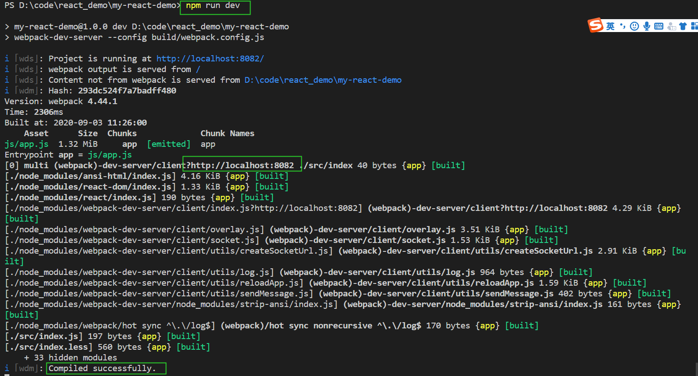
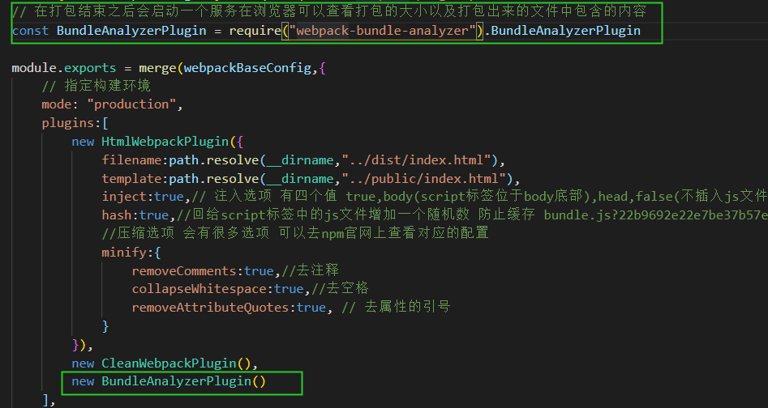

# webpack搭建项目流程
 对于前端同学来说webpack应该一点不陌生，现在应该大部分的工程都在使用webpack来进行构建。
 现在很多的框架都已经提供相应的脚手架命令行工具，直接执行之后就会生成对应的模板项目。
 不需要我们在脚手架上面浪费过多的时间，从而更加关注业务的编写，
 但是我们仍然需要知道webpack的工作原理到底是什么？知道之后也方便我们对现有的项目进行改造或者扩展。

 下面的教程是从0开始到完成webpack脚手架的搭建全过程，在编写过程中除了说明如何写之外也会穿插很多为什么。
 本篇文章大概分为以下几个部分：
 + webpack是什么？
 + 搭建第一步--npm init
 + 生成项目的目录结构
 + 安装基础的依赖
 + 安装loader、配置loader
 + 配置入口html -- html-webpack-plugin插件
 + 项目优化
 
 ## webpack是什么
  本质上，[webpack](https://webpack.docschina.org/concepts/) 是一个用于现代 JavaScript 应用程序的静态模块打包工具。  
  上面是webpack官网上面的解释，理解一下就是：webpack只是根据依赖关系把不同的模块根据不同规则打包成一个或多个文件，这就是webpack的作用。
## 搭建第一步 -- npm init 
  首先创建一个文件夹，进入到文件夹目录下，执行npm init命令，然后会生成一个package.json文件，此时项目初始化完成，这一步就是为了生成一个package.json文件  
  思考：  
  1. 为什么需要package.json?  
  package.json 文件里面存储的是你整个项目的信息，包括依赖包、版本等等，方便其他人快速了解你的项目以及能够快速修改你的项目。
  2. 不用npm init命令可以吗？  
  可以，可以从其他项目拷一份或自己新建一个package.json文件
## 生成项目的目录结构
  我这边js框架使用的是react，css框架使用的是less；其他的vue/sass/stylus等道理都是一样的。  

  目录结构如下：  
    

## 安装基础的依赖
   我们使用webpack作为我们项目的构建工具时 需要安装以下几个包：
   webpack/webpack-cli/webpack-dev-server
   
   ``` javascript
   //执行以下命令进行安装
    npm install webpack webpack-cli webpack-dev-server --save-dev 
   ```
  安装webpack-cli是为了可以使用webpack命令，也就是可以使用webpack命令,否则无法使用  
  
  下面我们修改一下package.json:
  在scripts中增加两条命令：  
  
  
  ### webpack和webpack-dev-server的区别:  

  webpack 是一个模块打包器，他会根据我们代码的依赖，然后编译文件，最后把编译好的文件输出到ouput选项中path路径里面

  webpack-dev-server 是webpack+httpserver 他会把编译好的文件放到内存中同时起一个http服务，这样我们可以本地调试代码
  

  除此之外我们使用react需要安装 react/react-dom两个包：
  ``` javascript
   //执行以下命令进行安装
    npm install react react-dom --save
   ```
  
  OK，至此我们已经完成了基础的依赖的安装，下面我们就可以直接执行npm run dev来把我们的工程跑起来了。

## 安装loader、配置loader
### 安装loader
   不出意外的话，你执行上一步的命令后会遇到下面的报错：  
  
  ??? 是否有很多问号？
  别怕 下面我们先分析一下:

  ``` javascript
    ERROR in ./src/index.js 6:4
    Module parse failed: Unexpected token (6:4)
    You may need an appropriate loader to handle this file type, currently no loaders are configured to process this file. See https://webpack.js.org/concepts#loaders
    | 
    | ReactDOM.render(
    >     <div>Hello World!</div>,
    |     document.getElementById('root')
    | )
  ```
  这个指的是webpack在编译我们的文件的时候遇见了一个模块转换错误，提示我们需要一个loader来解析这个文件，实际上我们并没有有个loader。  
  首先解释一下loader是什么？loader就是可以对我们源代码进行预处理，说白了就是他可以把我们的源代码处理成webpack认识的代码。  
  我们看上面报错的地方应该是jsx的语法，也就是说我们需要用loader把jsx转换成webpack认识的代码，
  这里我们使用的loader是： babel-loader   
  下面我们讲一下babel-loader配置方法：

  ``` javascript
    // 安装babel-loader需要使用的依赖包
    npm install babel-loader @babel/core @babel/preset-env @babel/preset-react  @babel/plugin-transform-runtime @babel/runtime @babel/runtime-corejs3 --save-dev 
  ```
  @babel/core  babel的核心库    
  @babel/preset-env  把es6,es7语法转换成es5，babel7以上的版本只用这一个预设包就可以实现语法的转换了，已经废弃了preset-stage-0,perset-stage-1,perset-stage-2等这些包了，但是这个包还不能转换es6，es7的一些新特性例如Array.includes()，这就需要我们使用@babel/plugin-reansform-runtime了  
  默认情况下 preset-env只会转换语法，如果要转换内置对象或者实例方法的话，需要使用polyfill来转换   
  使用useBuiltlns属性来控制@babel/preset-env使用何种的方式帮我们导入polyfill的核心，有三个值可选（entry,usage,false）  
  1. entry : 是一种入口导入方法，只要我们在打包配置入口，或者 文件入口写入 import “core-js”这样的一串代码，babel就会跟据我们配置的目标浏览器配置来引入所需要的polyfill(也就是说不管你用不用得到，只要浏览器不支持的都要引入)
     ``` javascript
      import "core-js"
      function test(){
        new Promise()
      }
      test()
      const arr = [1,3,4,5].map(item=>item*item)
     ```
  2. usage：会参考目标浏览器（browserslit）和代码中使用到的特性来按需加入polyfill
              使用该参数的话还需要传一个corejs的版本号
              core-js支持两个版本 2/3 ,很多新特性已经不会加到2里面了，比如：flat等等最新的方法，2版本里面没有，推荐使用3
  3. false: 不引入polyfill

  @babel/preset-react  把react语法转换成es5
  
  @babel/plugin-transform-runtime 支持一些es6，es7的新语法  把每个文件中的使用preset-env转换成的helper函数 --> 转换成使用babel-runtime中的helper函数，减少包体积
  
  @babel/runtime  这个包是 在进行es6转换成es5的时候会生成很多helper函数，这些函数每一个文件转换都会重复生成，这个包里面会包含这些helper函数，这样每个文件中引入helper函数的时候就直接引用这个包里面的文件了，减少了每个文件的包体积
   
  @babel-runtime 和 @babel/plugin-tranform-runtime 两个是什么关系？  
  @babel-runtime是一个核心，一种helper function的实现方式，而@babel/plugin-tranform-runtime 像是一个管家，负责更好的重复使用@babel-runtime 
### 配置loader
 根目录下新建一个build文件夹，新建webpack.config.js文件，用于更改webpack配置  
 为什么？ 因为我们现在使用的是webpack的默认命令，所以要更改的话需要指定webpack命令执行时的配置文件

 ``` javascript
  // build/webpack.config.js   
    const path = require("path")
    module.exports = {
        // 指定构建环境
        mode: "development",
        //入口
        entry:{
            app:'./src/index'
        },
        output:{
            path:path.resolve("../dist"),
            filename:'js/[name].js',
            publicPath:"/" //打包后的资源的访问路径前缀
        },
        module:{
            rules:[
                {
                    test:/\.jsx?$/,
                    exclude:/node_modules/, // 这个node_modules文件夹里面的js/jsx文件不需要使用babel-loader
                    loader:'babel-loader'
                    // babel-loader的参数配置也可以这样写，我们这里是新建一个.babelrc文件的方式来配置
                    // use: {  
                    //     loader: 'babel-loader',
                    //     options: {
                    //     presets: ['@babel/preset-env']
                    //     }
                    // }
                }
            ]
        }
    }
    // .babelrc文件
    {
      "presets": [
          ["@babel/preset-env",{
              "modules":false,
              "targets":{
                  "browsers":["> 1%","last 2 versions","not ie<=8"]
              }
          }],
          "@babel/preset-react"
      ],
      "plugins": [
          ["@babel/plugin-transform-runtime",{
              "corejs":3,
              "useBUildIns":"usage"
          }]
      ]
    }
    // package.json 修改scripts选项中的dev命令 
    
    "scripts": {
      "test": "echo \"Error: no test specified\" && exit 1",
      "dev": "webpack-dev-server --config build/webpack.config.js",
      "build": "webpack --config build/webpack.config.js" // --config 指的是使用指定文件的配置 这里我们使用的是刚刚创建的webpack.config.js
    },

    //  里面重要的配置已经加了注释，.babelrc中的如何写请查看官方文档，里面每个插件的作用是什么前面已经讲过了
 ```
 如果只使用了jsx语法的话 就已经可以编译和打包了
### css-loader style-loader less-loader 

如果你使用了我下面的语法的话 恭喜你，你在代码编译的时候还会继续报错


报错还是提示我们缺少loader，下面我们来讲一下关于css的loader

css-loader是为了处理import require @import url 这样的引入   

style-loader 是动态创建一个style 标签，然后把样式塞进去 添加到页面中的  

less-loader 是编译less语法  
  
执行顺序：如果loader选项是一个数组 那执行顺序是从右向左的  loader：['style-loader','css-loader']
          配置多个loader的话 是从下到上的执行顺序的

因此我们需要给我们的less文件同样配置loader

``` javascript
  // 同样的需要先安装

  npm install style-loader css-loader less-loader --save-dev

  // build/webpack.config.js
  module:{
        rules:[
            {
                test:/\.jsx?$/,
                exclude:/node_modules/,
                loader:'babel-loader'
            },
            {
                test:/\.css$/,
                use:[
                    {
                        loader:"style-loader"
                    },
                    {
                        loader:"css-loader"
                    }
                ]
            },
            {
                test:/\.less$/,
                use:[
                    {
                        loader:"style-loader"
                    },
                    {
                        loader:"css-loader"
                    },
                    {
                        loader:"less-loader"
                    }
                ]
            }
        ]
    }


```
正常情况下执行npm run dev  项目就会跑起来，

如果出现以下报错：

这个报错说我们缺少less模块，
less-loader我们安装的版本是7.0.0的版本，也就是说这个版本里面不在包含less包需要我们单独安装less包了
``` javascript 
//执行以下命令安装以下就好了
npm install less --save-dev 

```
到此我们的项目就已经成功跑起来了 并且没有报错了


## 配置入口html -- html-webpack-plugin插件

当我们打开 http://localhost:8080 的时候竟然是这样的？


是不是一脸蒙蔽？别怕，是因为我们尽管已经把工程跑起来了，但是我们并没有给他指定一个入口html，他这里是webpack-dev-server中默认的页面，所以我们就需要使用html-webpack-plugin来配置我们的入口html

``` javascript
// html-webpack-plugin 插件用法参考官网 
// 我们需要在webpack.config.js中增加plugins选项 来配置我们的入口html

// 同样首先需要安装一下html-webpack-plugin插件
npm install html-webpack-plugin --save-dev

// build/webpack.config.js 增加plugins选项
// 安装html-webpack-plugin
const HtmlWebpackPlugin = require("html-webpack-plugin")

plugins:[
    new HtmlWebpackPlugin({
        filename:path.resolve(__dirname,"../dist/index.html"),
        template:path.resolve(__dirname,"../public/index.html"),
        inject:true,// 注入选项 有四个值 true,body(script标签位于body底部),head,false(不插入js文件)
        hash:true,//回给script标签中的js文件增加一个随机数 防止缓存 bundle.js?22b9692e22e7be37b57e
    })
]
``` 
重新执行npm run dev 打开http://localhost:8080 就会看到我们写的Hello world！


到现在为止我们已经完成了工程的基础架构，如果是一些简单的页面上面的流程已经完全够用了，但是对于一些大中型的项目仍然需要做一些优化，下面会讲一下如何优化我们的工程

## 项目优化 
 这一部分我们会使用一些常用的插件来优化我们的构建流程，提升我们的构建时间和减少我们构建包体积大小
 ### 区分不同环境 
 我们日常工作中都是存在好几套环境的，测试环境、预生产环境、生产环境等等。因此在不同环境使用不同的配置项是有必要的。比如我们在测试环境没有必要压缩我们的代码，这样调试起来比较方便等等。下面我们来看一下区分不同环境需要怎么搞？
 #### 第一种方法：使用cross-env设置不同的环境变量，然后判断环境变量来使用不同的配置
    cross-env的作用就不在多说了，简单总结就是他可以跨不同环境设置变量的值
 ``` javascript 
    // 安装 cross-env
    npm install cross-env --save-dev 

    // package.json 增加测试命令 
    "build:test": "cross-env APP_ENV=test  webpack --config build/webpack.config.js",

    // webpack.config.js 增加测试代码
    // 我们根据APP_ENV不同的值来把构建的js文件放到不同的文件夹下面
    output:{
        path:process.env.APP_ENV === 'test' ? path.resolve(__dirname,"../test"): path.resolve(__dirname,"../dist"),
        filename:'js/[name].js',
        publicPath:"/" //打包后的资源的访问路径前缀
    },

 ```
修改完之后，执行 npm run build:test 命令，会打包生成一个test文件夹，如图所示：

除了可以配置不同的输出目录之前也可以根据环境变量的值判断是否需要一些其他的插件等等从而实现不同环境，不同配置的目标

 #### 第二种方法：生成不同的配置文件，执行相应的命令来执行不同的配置文件
 首先我们复制一份webpack.config.js，然后分别命名为webpack.dev.config.js和webpack.prod.config.js
 分别对应我们在development和production环境的配置，但是我们发现他们之前有很多的共同配置，因此我们还有把共同的配置抽离出来webpack.base.config.js文件。然后通过webpack-merge插件把他们合并起来。
 具体实现如下：
 ``` javascript
    // 安装依赖 webpack-merge 
    npm install webpack-merge --save-dev 

    // webpack.base.config.js
    
    const path = require("path")

    module.exports = {
        //入口
        entry:{
            app:'./src/index'
        },
        output:{
            path:path.resolve(__dirname,"../dist"),
            filename:'js/[name].js',
            publicPath:"/" //打包后的资源的访问路径前缀
        },
        module:{
            rules:[
                {
                    test:/\.jsx?$/,
                    exclude:/node_modules/, // 这个node_modules文件夹里面的js/jsx文件不需要使用babel-loader
                    loader:'babel-loader'
                    // babel-loader的参数配置也可以这样写，我们这里是新建一个.babelrc文件的方式来配置
                    // use: {  
                    //     loader: 'babel-loader',
                    //     options: {
                    //     presets: ['@babel/preset-env']
                    //     }
                    // }
                },
                {
                    test:/\.css$/,
                    use:[
                        {
                            loader:"style-loader"
                        },
                        {
                            loader:"css-loader"
                        }
                    ]
                },
                {
                    test:/\.less$/,
                    use:[
                        {
                            loader:"style-loader"
                        },
                        {
                            loader:"css-loader"
                        },
                        {
                            loader:"less-loader"
                        }
                    ]
                }
            ]
        },
    }

    // webpack.dev.config.js
        
    const path = require("path")
    // 安装html-webpack-plugin
    const HtmlWebpackPlugin = require("html-webpack-plugin")
    const webpackBaseConfig = require("./webpack.base.config.js")
    // 根据不同规则合并两个配置项，
    const { merge } = require("webpack-merge")

    module.exports = merge(webpackBaseConfig,{
        // 指定构建环境
        mode: "development",
        plugins:[
            new HtmlWebpackPlugin({
                filename:path.resolve(__dirname,"../dist/index.html"),
                template:path.resolve(__dirname,"../public/index.html"),
                inject:true,// 注入选项 有四个值 true,body(script标签位于body底部),head,false(不插入js文件)
            })
        ]
    })

    // webpack.prod.config.js
    
    const path = require("path")
    // 安装html-webpack-plugin
    const HtmlWebpackPlugin = require("html-webpack-plugin")

    const webpackBaseConfig = require("./webpack.base.config.js")
    const { merge } = require("webpack-merge")


    module.exports = merge(webpackBaseConfig,{
        // 指定构建环境
        mode: "production",
        plugins:[
            new HtmlWebpackPlugin({
                filename:path.resolve(__dirname,"../dist/index.html"),
                template:path.resolve(__dirname,"../public/index.html"),
                inject:true,// 注入选项 有四个值 true,body(script标签位于body底部),head,false(不插入js文件)
                hash:true,//回给script标签中的js文件增加一个随机数 防止缓存 bundle.js?22b9692e22e7be37b57e
                //压缩选项 会有很多选项 可以去npm官网上查看对应的配置
                minify:{
                    removeComments:true,//去注释
                    collapseWhitespace:true,//去空格
                    removeAttributeQuotes:true, // 去属性的引号
                }
            })
        ]
    })
    

    // 最后修改package.json中的打包命令配置文件
    "scripts": {
        "test": "echo \"Error: no test specified\" && exit 1",
        "dev": "webpack-dev-server --config build/webpack.dev.config.js",
        "build": "webpack --config build/webpack.prod.config.js"
    },
 ```
到这里我们就把不同环境的配置文件分离开来，这样后面再增加配置的时候就会更加清晰。


 ### 压缩js
 原来我们构建的时候压缩js使用的是uglifyjs-webpack-plugin，但是webpack4以后官网推荐使用terser-webpack-plugin
 terser-webpack-plugin 也是webpack 4的内置插件(也就是说我们不需要自己添加这个插件就可以压缩js代码，但是如果我们不想使用默认的配置的话 需要重新定义)
 使用方法如下：
 ``` javascript
    // 安装插件terser-webpack-plugin
    npm install terser-webpack-plugin --save-dev
    // 因为这个插件只会在生产环境生效也就是说这个配置我们要写在webpack.prod.config.js中
    // webpack.prod.config.js  增加optimization选项 （和plugins/mode平级的）
    // Optimization 这个选项是可以覆盖webpack内置的一些配置 比如 压缩、分包机制等等
    optimization:{
        minimizer:[
            new TerserWebpackPlugin({
                parallel:true,
                sourceMap:false,
                exclude:/\/node_modules/,
                extractComments: true, // 这个选项如果为true 会生成一个app.js.LICENSE.txt文件 存储特定格式的注释
                terserOptions:{
                    warnings:false,
                    compress:{
                        unused:true,
                        drop_debugger:true,
                        drop_console:true
                    },
                }
            })
        ]
    }
 ```
这个时候执行npm run build 打包的话，打包之后的提交不会有太大的改变，因为webpack4已经内置了这个插件，对我们的代码已经进行了压缩处理，但是我们还是需要了解一下这个插件的一些配置项的

### 提取css文件/压缩css
#### 提取css文件
我们可以看一下我们打包生成的文件，是没有css文件的，因为webpack默认会把css当做一个模块打包到相应的js文件中去，
但是这样的话也导致我们的bundle文件比较大，所以把css单独拆分出来是有必要的。  
在这里我们提取单独的css文件使用的插件是：mini-css-extract-plugin（该插件同样只在生产环境下生效）

具体的配置如下：
``` javascript
    // 安装插件
    npm install mini-css-extract-plugin --save-dev

    // 修改webpack.base.config.js中 增加插件mini-css-extract-plugin 
    plugins:[
        new MiniCssExtractPlugin({
            filename:'css/[name].css',
            chunkFilename:'css/[id].css'
        })
    ],
    // 同时要修改css/less的loader  
    // 此处是截取的module --> rules里面的需要修改的代码 
    // 把style-loader注释掉是因为两个会冲突，导致报错
    {
                test:/\.css$/,
                use:[
                    {
                        loader:MiniCssExtractPlugin.loader,
                        options:{
                            hmr:true,
                            reloadAll:true
                        }
                    },
                    // {
                    //     loader:"style-loader"
                    // },
                    {
                        loader:"css-loader"
                    }
                ]
            },
            {
                test:/\.less$/,
                use:[
                    {
                        loader:MiniCssExtractPlugin.loader,
                        options:{
                            hmr:true,
                            reloadAll:true
                        }
                    },
                    // {
                    //     loader:"style-loader"
                    // },
                    {
                        loader:"css-loader"
                    },
                    {
                        loader:"less-loader"
                    }
                ]
            }

``` 
我们再次打包之后就可以看见已经生成了一个app.css文件


#### 压缩css
我们打开刚打包的app.css文件可以看到并没有对内容进行压缩，
  
下面我们来实现把css压缩的功能，这里我们使用的插件是：optimize-css-assets-webpack-plugin
具体实现如下：

``` javascript 
// 安装插件 optimize-css-assets-webpack-plugin
npm install optimize-css-assets-webpack-plugin --save-dev 

//同样修改optimization选项 来重写默认配置
optimization:{
    minimizer:[
        new TerserWebpackPlugin({
            parallel:true,
            sourceMap:false,
            exclude:/\/node_modules/,
            extractComments: true, // 这个选项如果为true 会生成一个app.js.LICENSE.txt文件 存储特定格式的注释
            terserOptions:{
                warnings:false,
                compress:{
                    unused:true,
                    drop_debugger:true,
                    drop_console:true
                },
            }
        }),
        // 压缩css
        new OptimizeCssAssetsPlugin({
            cssProcessorOptions:{safe:true,discardComments:{removeAll:true}}
        })
    ]
}
```
再次打包之后，打开app.css里面的代码已经被压缩过了


### 清空构建目录/构建包分析
#### 清空构建目录
现在我们打包的话生成的app.js文件都没有带随机数来防止缓存，我们现在加上这个功能：
就是在我们的output里面加一个配置
  
然后我们就可以看到我们的dist文件夹里面会出现这样的情况：
  
也就是说我们以前构建的文件都没有被删除  
webpack提供了一个插件来帮助我们删除原来的dist目录：clean-webpack-plugin
不需要什么特殊的配置，直接添加到plugins选项里就好了
  

这样我们在重新构建之前就会清空dist目录了

#### 构建包分析
在构建之后我们想要查看我们的构建包里面都包含什么东西，方便我们后期进行优化，这个时候就需要用到包分析插件了，  
我们使用webpack-bundle-analyzer来实现这个功能。  
同样的添加到plugins选项中就好了：

打包结束的时候会自动打开浏览器，展示对应的包大小和包里面包含的内容：


### 构建包拆分
webpack3中拆包使用 common-chunk-plugin拆包 具体用法参考百度
 webpack4中通过设置splitChunks参数
 splitChunks默认参数：(是在optimization中的一个property)
 ``` javascript
  splitChunks: {
    // async表示只从异步加载得模块（动态加载import()）里面进行拆分(会拆分出通过懒加载等方式异步加载的模块)
    // initial表示只从入口模块进行拆分（入口文件会包含node_modules中的react-dom等包,但是在blog.js中异步加载的marterial等插件就没有拆分出来 和业务代码打包成了一个包）
    // all表示以上两者都包括
    chunks: "async",
    minSize: 30000,   // 大于30k会被webpack进行拆包
    minChunks: 1,     // 被引用次数大于等于这个次数进行拆分
    // import()文件本身算一个
    // 只计算js，不算css
    // 如果同时有两个模块满足cacheGroup的规则要进行拆分，但是maxInitialRequests的值只能允许再拆分一个模块，那尺寸更大的模块会被拆分出来
    maxAsyncRequests: 5,  // 最大的按需加载（异步）请求次数
    // 最大的初始化加载请求次数,为了对请求数做限制，不至于拆分出来过多模块
    // 入口文件算一个
    // 如果这个模块有异步加载的不算
    // 只算js，不算css
    // 通过runtimeChunk拆分出来的runtime不算在内
    // 如果同时又两个模块满足cacheGroup的规则要进行拆分，但是maxInitialRequests的值只能允许再拆分一个模块，那尺寸更大的模块会被拆分出来
    maxInitialRequests: 3,
    automaticNameDelimiter: '~', // 打包分隔符
    name:true,
    cacheGroups: {
        // 默认的配置
        vendors: {
            test: /[\\/]node_modules[\\/]/,
            priority: -10
        },
        // 默认的配置，vendors规则不命中的话，就会命中这里
        default: {
            minChunks: 2, // 引用超过两次的模块 -> default
            priority: -20,
            reuseExistingChunk: true
        },
    },
  }

 ```
我们这里使用 chunks:"all" 方式拆分的结果如下：


### 静态资源打包
一般我们的项目中的静态资源是不需要webpack处理的只需要把他们复制到对应的构建目录中就可以了，
我们使用的插件是：copy-webpack-plugin


### 多页应用打包配置
目前我们的这个应用是单页应用，如果要是多页应用的话需要我们增加多个入口和多个出口、以及增加对应的html模板文件
也就是说我们直接改entry,以及增加html模板就好了
``` javascript
  // 首先增加我们的多页应用 目录结构如下
  // 我们把不同的页面的文件拆分开 这样后期处理起来比较方便，结构也比较清晰
  -src
   - detail
    - index.js
   - index
    - css
     - index.css
    - index.js
  //修改entry 增加入口
    entry:{
        app:'./src/index/index',
        detail:"./src/detail/index"
    },
  // 增加html模板 
    plugins:[
        new HtmlWebpackPlugin({
            filename:path.resolve(__dirname,"../dist/index.html"),
            template:path.resolve(__dirname,"../public/index.html"),
            inject:true,
            chunks:['app'] // 这个和entry中的key对应 代表这个入口html需要引入哪个依赖的文件
        }),
        new HtmlWebpackPlugin({
            filename:path.resolve(__dirname,"../dist/detail.html"),
            template:path.resolve(__dirname,"../public/index.html"),
            inject:true,
            chunks:['detail']
        })
    ]
  
```
这样写的话 当页面比较少的话可以一个一个加 但是当页面比较多的时候不够智能，这个时候我们可以使用glob插件 来直接拿到我们src文件夹下面的page文件夹下面的文件名，然后编写函数来实现动态的设置入口和html模板

``` javascript
// 安装glob插件
npm install glob --save-dev 

// build文件夹下面增加util.js 文件
const path = require("path")
const glob = require("glob")

let chunksList = []
let entry = {}

function  getModulesList() {
    //[ '../src/pages/detail', '../src/pages/index' ]
    let modulesList = glob.sync(path.resolve(__dirname,'../src/pages/*'))
    for(let i = 0,len = modulesList.length; i<len;i++){
        let moduleName = modulesList[i].split('/').slice(-1).join()
        chunksList.push(moduleName)
        entry[moduleName] = path.resolve(__dirname,"../src/pages/"+moduleName+'/index.js')
    }
}

getModulesList()


module.exports = {
    resolve:function (dir) {
        return path.resolve(__dirname,dir)
    },
    entry:entry,
    chunks:chunksList
}
```
通过上面的函数能够拿到entry,然后同样也可以得到对应的html模板


### 其他优化

  #### 打包提示信息优化
  我们在打包的时候会有build信息打印出来，但是我们并不关注这些东西，所以我们可以把这些信息直接去掉。
  具体实现如下：
  


## 总结

到这里的话我们就已经实现了一个相对完整的webpack构建的项目代码。其中除了说明怎么配置之外还加入了很多为什么的思考，希望大家看完之后不仅仅知道怎么样去搭建一个项目，而是知道为什么


## 思考

1. 为什么loader的执行顺序是从右向左，从下向上(提示：compose与pipe)

2. terser-webpack-plugin插件和uglifyjs-webpack-plugin插件的区别

