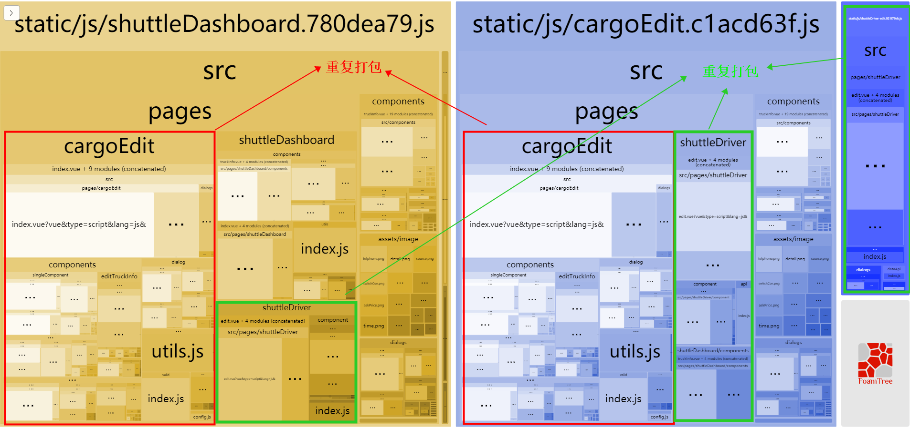
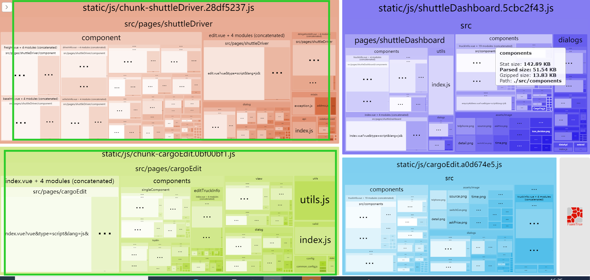
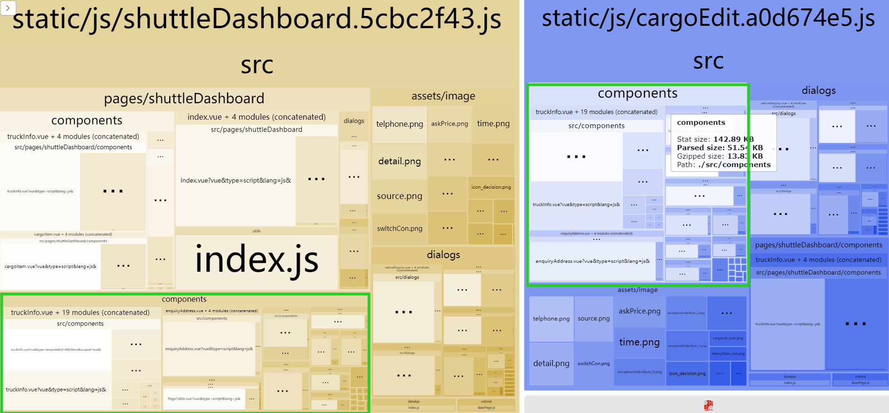
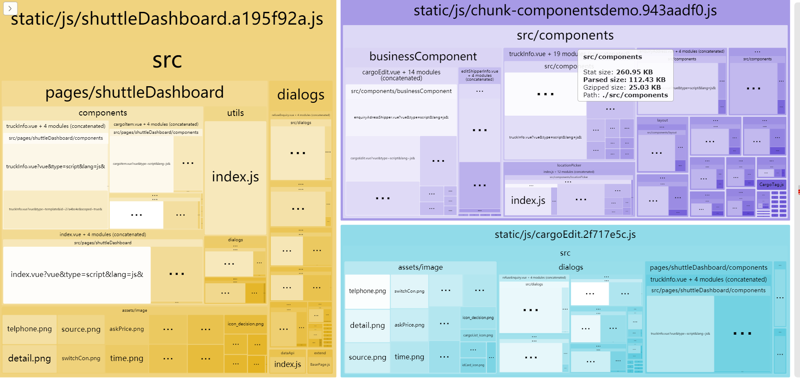
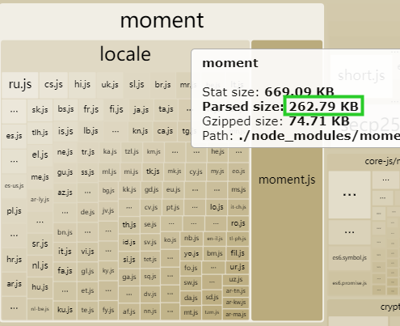

# webpack打包优化

## 前言
 最近在搞项目打包优化，遇见了一些问题也解决了一些问题，感觉有必要记录一下优化的过程，希望能够对存在同样打包问题的朋友有所帮助。
## 打包分析
  既然要优化打包过程，那就需要我们知道打包存在什么问题，首先推荐两个工具：  
  1. speed-measure-webpack-plugin 
    这个插件能够清楚的打印出打包过程中耗费的时间，帮助我们分析打包的过程中什么时间发生了什么事情
  2. webpack-bundle-analyzer 
    这个插件可以展示我们打包出来的文件包含那些module，帮助我们分析打包出来的文件是否合理
  基于上面两个插件我们首先来分析一下我们项目打包完之后的文件存在哪些问题：
  + 存在过多废弃文件
  + 多个chunks中存在重复代码
  + 存在占用体积较大但是用处不大或根本没用的插件
  + 图片没有压缩
  + 会有多个空的js文件
  下面我们来基于上面发现的问题来逐条优化
## 删除废弃代码
  这个流程就不再多说，可以根据自己项目自行删除  
## 优化拆包逻辑，提取公共文件（splitChunks）
 删除废弃代码后，我们使用上面所说的webpack-bundle-analyzer插件来分析一些我们打包出来的文件，可以发现因为存在模块相互引用的情况，所以被引用的组件会出现打包出来两份的情况，如图：  
    

 因为我们使用的是import动态引入组件的方式实现路由懒加载，造成我们多个组件被打包了两次，针对这种情况可以使用webpack中的splitChunks选项来把公共的部分单独拆分出来，具体操作如下：
 我们用的vue-cli来搭建的脚手架，可以在chainWebpack中修改默认的配置，增加我们的拆包逻辑：
 ```javascript
 chainWebpack: config => {
    config.optimization.splitChunks({
      cacheGroups: {
        vendors: { // 这个是vue-cli默认的选项
          name: 'chunk-vendors',
          test: /[\\/]node_modules[\\/]/,
          priority: -10,
          chunks: 'all' // initial 表示拆分入口文件 但是我们组件中加载的node_module中的包不会单独拆分出来。使用all是两者都拆分出来
        },
        // 增加我们公共组件的拆包逻辑
        shuttleDriver: { 
          name: 'chunk-shuttleDriver',
          test (module, chunks) {
            const path = require('path')
            return (
              module.resource &&
              module.resource.includes(`${path.sep}shuttleDriver${path.sep}`)
            )
          },
          minChunks: 2,
          priority: 10,
        },
        cargoEdit: {
          name: 'chunk-cargoEdit',
          test (module, chunks) {
            const path = require('path')
            return (
              module.resource &&
              module.resource.includes(`${path.sep}cargoEdit${path.sep}`)
            )
          },
          minChunks: 2,
          priority: 0,
        },
        // vue-cli 的默认选项
        common: {
          name: 'chunk-common',
          minChunks: 2,
          priority: -30,
          chunks: 'initial',
          reuseExistingChunk: true
        },
      }
    })
  },
 ```
 使用上述配置打包后会生成chunk-cargoEdit和chunk-shuttleDriver两个包，存储公共的文件，如图：
   
 现在我们就把两个被多次调用的组件拆分了出来，然后我们再看我们打包出来的文件，会发现其中src/components中中的文件存在同样的问题：  
   
 
 因此我们也可以使用上面方法把公用组件单独打包，同样在chainWebpack中增加类似配置：
 ```javascript
    components: {
        name: 'chunk-components',
        test: /[\\/]src[\\/]components[\\/]/,
        priority: 15,// 注意和其他拆分逻辑的优先级，priority越大 优先级越高
    },
 ```
同样打包之后也会生成一个chunk-components文件，包含的是我们的所有的公用组件代码，如图：
  

 ### 总结
  因为组件直接存在相互引用，而且使用import方式实现懒加载，所以被引用的文件会被打包多次，可以使用splitChunks选项来把体积比较大的被引用组件进行拆包处理

## 删除体积较大但用处不大的插件
  比如说moment插件，只是使用format方法，但是这个插件打包处理体积很大：
    
  其他插件的可以根据项目情况来自行处理，这里就不多做描述

## 图片没有压缩
  可以直接使用[tinypng](https://tinypng.com/)来压缩，或者其他方法（网上有很多，自行百度）

## 会有多个空的js文件
